**program:**

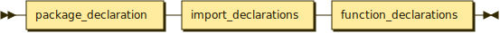

```
program  ::= package_declaration import_declarations function_declarations
```

**package_declaration:**

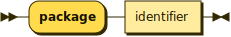

```
package_declaration
         ::= 'package' identifier
```

referenced by:

* program

**import_declarations:**

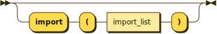

```
import_declarations
         ::= ( 'import' '(' import_list ')' )?
```

referenced by:

* program

**import_list:**

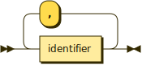

```
import_list
         ::= identifier ( ',' identifier )*
```

referenced by:

* import_declarations

**function_declarations:**

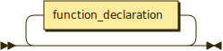

```
function_declarations
         ::= function_declaration*
```

referenced by:

* program

**function_declaration:**

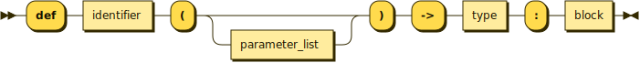

```
function_declaration
         ::= 'def' identifier '(' parameter_list? ')' '->' type ':' block
```

referenced by:

* function_declarations

**parameter_list:**

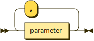

```
parameter_list
         ::= parameter ( ',' parameter )*
```

referenced by:

* function_declaration

**parameter:**

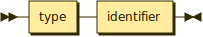

```
parameter
         ::= type identifier
```

referenced by:

* parameter_list

**type:**

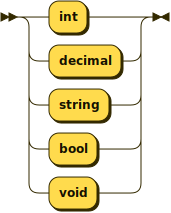

```
type     ::= 'int'
           | 'decimal'
           | 'string'
           | 'bool'
           | 'void'
```

referenced by:

* function_declaration
* parameter
* variable_declaration

**block:**

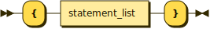

```
block    ::= '{' statement_list '}'
```

referenced by:

* function_declaration
* if_statement
* while_loop

**statement_list:**

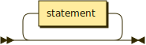

```
statement_list
         ::= statement*
```

referenced by:

* block

**statement:**

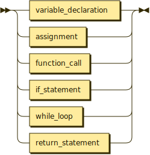

```
statement
         ::= variable_declaration
           | assignment
           | function_call
           | if_statement
           | while_loop
           | return_statement
```

referenced by:

* statement_list

**variable_declaration:**

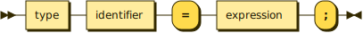

```
variable_declaration
         ::= type identifier '=' expression ';'
```

referenced by:

* statement

**assignment:**

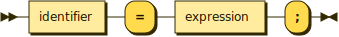

```
assignment
         ::= identifier '=' expression ';'
```

referenced by:

* statement

**function_call:**

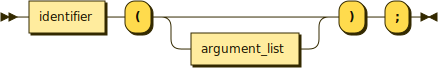

```
function_call
         ::= identifier '(' argument_list? ')' ';'
```

referenced by:

* expression
* statement

**argument_list:**


```
argument_list
         ::= expression ( ',' expression )*
```

referenced by:

* function_call

**if_statement:**

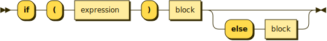

```
if_statement
         ::= 'if' '(' expression ')' block ( 'else' block )?
```

referenced by:

* statement

**while_loop:**

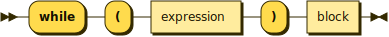

```
while_loop
         ::= 'while' '(' expression ')' block
```

referenced by:

* statement

**return_statement:**


```
return_statement
         ::= 'return' expression? ';'
```

referenced by:

* statement

**expression:**

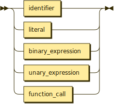

```
expression
         ::= identifier
           | literal
           | binary_expression
           | unary_expression
           | function_call
```

referenced by:

* argument_list
* assignment
* binary_expression
* if_statement
* return_statement
* unary_expression
* variable_declaration
* while_loop

**literal:**


```
literal  ::= integer_literal
           | decimal_literal
           | string_literal
           | boolean_literal
```

referenced by:

* expression

**binary_expression:**

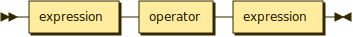

```
binary_expression
         ::= expression operator expression
```

referenced by:

* expression

**unary_expression:**

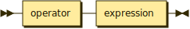

```
unary_expression
         ::= operator expression
```

referenced by:

* expression

**operator:**

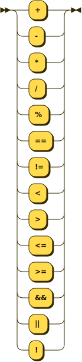

```
operator ::= '+'
           | '-'
           | '*'
           | '/'
           | '%'
           | '=='
           | '!='
           | '<'
           | '>'
           | '<='
           | '>='
           | '&&'
           | '||'
           | '!'
```

referenced by:

* binary_expression
* unary_expression

**integer_literal:**

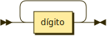

```
integer_literal
         ::= dígito+
```

referenced by:

* literal

**decimal_literal:**

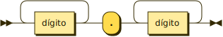

```
decimal_literal
         ::= dígito+ '.' dígito+
```

referenced by:

* literal

**string_literal:**

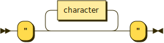

```
string_literal
         ::= '"' character* '"'
```

referenced by:

* literal

**boolean_literal:**


```
boolean_literal
         ::= 'true'
           | 'false'
```

referenced by:

* literal

**identifier:**

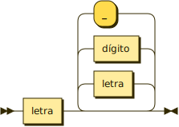

```
identifier
         ::= letra ( letra | dígito | '_' )*
```

referenced by:

* assignment
* expression
* function_call
* function_declaration
* import_list
* package_declaration
* parameter
* variable_declaration

**letter:**

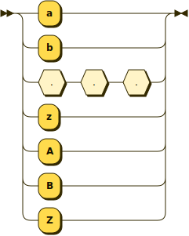

```
letter   ::= 'a'
           | 'b'
           | . . .
           | 'z'
           | 'A'
           | 'B'
           | 'Z'
```

## 
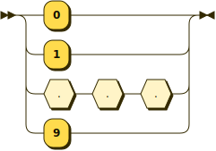 <sup>generated by [RR - Railroad Diagram Generator][RR]</sup>

[RR]: https://www.bottlecaps.de/rr/ui